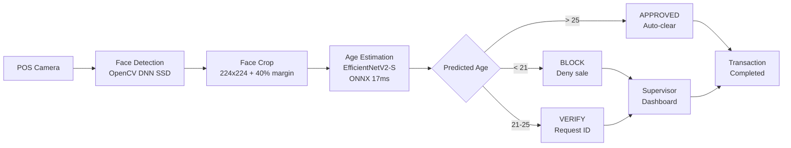

# AgeGuard AI — Automated Age Verification System

> Deep learning-powered age estimation for regulated retail environments. Real-time facial analysis with a three-tier alert system (RED/YELLOW/GREEN) for compliance at point of sale.


### [Live Demo](https://huggingface.co/spaces/marianunez-data/AgeGuard-AI) | [Dashboard](https://ageguard-ai-dashboard.streamlit.app) | [API](https://ageguard-ai.onrender.com/docs)

---

## Business Problem

Retail businesses selling age-restricted products face regulatory fines averaging $10K per violation when minors are not properly identified. Human verification is inconsistent, employees make errors under pressure during rush hours, shift changes, and high-volume periods. AgeGuard AI automates the first layer of age verification, alerting supervisors when a customer's predicted age falls below the safety threshold.

## System Architecture


## Key Results

| Metric | Value | Target |
|---|---|---|
| Test MAE (global) | 5.02 years | <= 5.0 |
| Test MAE (18-25 critical) | 4.34 years | <= 5.0 |
| False Accept Rate (threshold 25) | 12.3% | Minimized |
| False Reject Rate (threshold 25) | 20.3% | Acceptable |
| Inference latency | 16.7 ms | < 50 ms |
| Adult auto-approval | 79.7% | Maximized |
| Model size (ONNX) | 77.5 MB | Deployable |

## Deployed Services

| Platform | URL | Purpose |
|---|---|---|
| HuggingFace Spaces | [Live Demo](https://huggingface.co/spaces/marianunez-data/AgeGuard-AI) | Interactive demo: upload a face image |
| Streamlit Cloud | [Dashboard](https://ageguard-ai-dashboard.streamlit.app) | Business intelligence dashboard |
| Render | [API](https://ageguard-ai.onrender.com/docs) | Production REST API (FastAPI) |

## Project Structure
```
AgeGuard-AI/
├── artifacts/              # EDA summary, removal lists, split stats
├── configs/
│   └── base_config.yaml    # All hyperparameters (Pydantic-validated)
├── data/                   # Original + processed images (DVC tracked)
├── models/                 # Checkpoints + ONNX + face detector (DVC tracked)
├── notebooks/
│   └── AgeGuard-AI.ipynb   # Full pipeline notebook (6 phases)
├── reports/
│   ├── eda/                # 17+ EDA visualizations + GE reports
│   ├── training/           # Training curves + summary JSON
│   ├── evaluation/         # Test metrics + threshold analysis + demo
│   └── explainability/     # GradCAM heatmaps
├── src/
│   ├── config.py           # Pydantic config loader
│   ├── dataset.py          # PyTorch Dataset + augmentation transforms
│   ├── model.py            # EfficientNetV2-S regression head
│   ├── train.py            # Training loop with crash recovery
│   ├── inference.py        # ONNX production inference + alert system
│   └── api.py              # FastAPI REST endpoint
├── tests/                  # pytest (21/21 passing)
├── Dockerfile              # Production container
├── app.py                  # Gradio demo (HuggingFace Spaces)
├── streamlit_app.py        # BI dashboard (Streamlit Cloud)
└── requirements.txt
```

## Quick Start
```bash
git clone https://github.com/marianunez-data/AgeGuard-AI.git
cd AgeGuard-AI
pip install -r requirements.txt
```

### Predict age from image
```python
from src.inference import AgePredictor

predictor = AgePredictor(model_path="models/onnx/ageguard_v1.onnx")
result = predictor.predict("path/to/face.jpg")
# {'predicted_age': 22, 'alert_level': 'YELLOW', 'action': 'VERIFY — Request ID'}
```

### API call
```bash
curl -X POST https://ageguard-ai.onrender.com/predict -F "file=@face.jpg"
```

### Run tests
```bash
python -m pytest tests/ -v
# 21/21 passing
```

## Pipeline Phases

| Phase | Description | Key Output |
|---|---|---|
| 1. Setup | Project structure, Pydantic config, YAML | config.py, base_config.yaml |
| 2. EDA | 11 audits: age distribution, resolution, blur, duplicates, face detection | eda_summary.json, 17+ reports |
| 3. Preprocessing | Visual review, face crop, grayscale conversion, stratified split | 7446 clean images (224x224) |
| 4. Training | EfficientNetV2-S, HuberLoss(d=5.0), CosineAnnealing, AMP | best_model.pth, MAE 5.09 (val) |
| 5. Evaluation | Test metrics, per-band MAE, FAR/FRR threshold optimization | test_evaluation.json |
| 6. Explainability | GradCAM visualization + ONNX export + live demo | ageguard_v1.onnx, GradCAM heatmaps |

## Technical Decisions and Trade-offs

| Decision | Chose | Over | Why |
|---|---|---|---|
| Architecture | EfficientNetV2-S (20.3M params) | ResNet50, MobileNetV3 | Selected for balance between parameter count and inference speed. 20.3M params with 17ms latency meets the <50ms real-time requirement while maintaining MAE 5.02 |
| Loss function | HuberLoss (delta 5.0) | MSE, MAE | MSE destabilizes on mislabeled samples (found 1+ in UTKFace). MAE loses fine gradient signal. Huber with delta=5.0 gives MSE precision below 5yr error and MAE robustness above |
| Face detector | OpenCV DNN SSD | MediaPipe | MediaPipe broke API in v0.10.13+ (experienced during development). SSD was a reliable fallback that worked for face cropping |
| Alert threshold | 25 years | 21, 23, 28 | Tested all thresholds in Phase 5. At 21: FAR 28.9%. At 25: FAR 12.3% with FRR 20.3%. Best balance between compliance risk and customer experience |
| Export format | ONNX | TorchScript | ONNX selected for cross-platform compatibility. Achieved 17ms inference on CPU in our benchmark |
| Normalization | ImageNet stats | Custom stats | EDA confirmed dataset pixel distribution within 0.05 of ImageNet means: preserves transfer learning benefits |
| Face crop margin | 40% | — | Standard margin for face detection crops. Captures full face with surrounding context for age-relevant features |
| Blur handling | Remove only Lap < 20 | Remove all (Lap < 80), Keep all | Tested in Phase 3: removing all 1385 loses 23.5% of 18-25 band. Lap < 20 removes only 33 genuinely unusable images |

## Failure Modes

| Failure | Impact | Mitigation |
|---|---|---|
| No face in image | Model outputs meaningless prediction | Validates image loading. Production improvement: add face detection pre-check |
| Extreme lighting | Prediction less accurate | ColorJitter augmentation during training improves robustness to lighting variation |
| Multiple faces | Processes full image without selection | Production version would use face detection to isolate individual faces |
| Adversarial input (makeup, disguise) | Age prediction may be incorrect | Known limitation: human verification layer is the safeguard |
| Mislabeled training data | Model learns incorrect patterns | HuberLoss (delta 5.0) reduces impact. At least 1 mislabel confirmed in Phase 3 |
| Model drift | Accuracy degrades over time | Not implemented. Recommendation: monitor MAE on new data and retrain periodically |
| Server overload | Slow or failed predictions | Health endpoint enables monitoring. Production would use auto-scaling |

## Data Quality Measures

- Manual visual review of 110 no-face candidates + 41 duplicate pairs
- Multi-threshold analysis: identified 41.8% false rejection rate at default threshold
- 53 images rescued from incorrect removal through visual verification
- Blur audit with conservative threshold (Lap < 20): only 33 extreme cases removed
- Great Expectations: 2 validation gates (post-EDA 8/8, post-cleanup 12/12)
- Stratified split verified: 18-25 band consistent at ~21% across train/val/test
- pytest: 21/21 automated tests passing

## Known Limitations

1. UTKFace mislabels: dataset contains incorrect age labels. Mitigated with HuberLoss but not eliminated.
2. Age extremes: MAE degrades at 60+ (9.98 years). Irrelevant for compliance since no one asks for ID at 60.
3. Single dataset: trained only on UTKFace. Production would benefit from POS camera data.
4. Face detector: OpenCV DNN SSD has 41.8% false rejection at threshold 0.7.
5. No adversarial robustness: not tested against deliberate evasion (heavy makeup, prosthetics).

## Fairness Considerations

This model was trained on UTKFace which has demographic imbalances. No fairness analysis was performed across gender, ethnicity, or skin tone. Before production deployment, it is essential to evaluate prediction accuracy across demographic groups to ensure the system does not disproportionately flag or miss specific populations. This is a documented next step.

## Future Improvements

- [ ] Face alignment with landmark detection (dlib/MTCNN) to normalize eye-line orientation
- [ ] Hyperparameter optimization with Optuna on validation set
- [ ] Face detection pre-check before age prediction
- [ ] Fine-tune on POS camera dataset for domain adaptation
- [ ] Demographic fairness analysis across age, gender, ethnicity

## Tech Stack

**ML/DL:** PyTorch, EfficientNetV2-S, ONNX Runtime, torchvision

**Computer Vision:** OpenCV DNN (face detection + cropping), GradCAM

**Data:** pandas, numpy, scikit-learn, Pillow, imagehash

**Validation:** Great Expectations, Pydantic, pytest

**Deployment:** FastAPI, Gradio, Streamlit, Docker, Render, HuggingFace Spaces

**MLOps:** DVC (data versioning), GitHub Actions (CI/CD), YAML config
