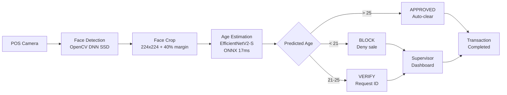

# AgeGuard AI — Automated Age Verification System

> Deep learning-powered age estimation for regulated retail environments. Real-time facial analysis with a three-tier alert system (RED/YELLOW/GREEN) for compliance at point of sale.


### [Live Demo](https://huggingface.co/spaces/marianunez-data/AgeGuard-AI) | [Dashboard](https://ageguard-ai-dashboard.streamlit.app) | [API](https://ageguard-ai.onrender.com/docs)

---

## Business Problem

Retail businesses selling age-restricted products face regulatory fines averaging $10K per violation when minors are not properly identified. Human verification is inconsistent — employees make errors under pressure during rush hours, shift changes, and high-volume periods. AgeGuard AI automates the first layer of age verification, alerting supervisors when a customer's predicted age falls below the safety threshold.

## System Architecture


## Key Results

| Metric | Value | Target | Status |
|---|---|---|---|
| Test MAE (global) | 5.02 years | <= 5.0 | Near target |
| Test MAE (18-25 critical) | 4.34 years | <= 5.0 | Met |
| False Accept Rate (threshold 25) | 12.3% | Minimized | Acceptable |
| False Reject Rate (threshold 25) | 20.3% | Acceptable | Met |
| Inference latency | 16.7 ms | < 50 ms | Met (3x faster) |
| Adult auto-approval | 79.7% | Maximized | Met |
| Model size (ONNX) | 77.5 MB | Deployable | Met |

## Deployed Services

| Platform | URL | Purpose |
|---|---|---|
| HuggingFace Spaces | [Live Demo](https://huggingface.co/spaces/marianunez-data/AgeGuard-AI) | Interactive demo — upload a face image |
| Streamlit Cloud | [Dashboard](https://ageguard-ai-dashboard.streamlit.app) | Business intelligence dashboard |
| Render | [API](https://ageguard-ai.onrender.com/docs) | Production REST API (FastAPI) |

## Project Structure
```
AgeGuard-AI/
├── artifacts/              # EDA summary, removal lists, split stats
├── configs/
│   └── base_config.yaml    # All hyperparameters (Pydantic-validated)
├── data/                   # Original + processed images (DVC tracked)
├── models/                 # Checkpoints + ONNX + face detector (DVC tracked)
├── notebooks/
│   └── AgeGuard-AI.ipynb   # Full pipeline notebook (6 phases)
├── reports/
│   ├── eda/                # 17+ EDA visualizations + GE reports
│   ├── training/           # Training curves + summary JSON
│   ├── evaluation/         # Test metrics + threshold analysis + demo
│   └── explainability/     # GradCAM heatmaps
├── src/
│   ├── config.py           # Pydantic config loader
│   ├── dataset.py          # PyTorch Dataset + augmentation transforms
│   ├── model.py            # EfficientNetV2-S regression head
│   ├── train.py            # Training loop with crash recovery
│   ├── inference.py        # ONNX production inference + alert system
│   └── api.py              # FastAPI REST endpoint
├── tests/                  # pytest (21/21 passing)
├── Dockerfile              # Production container
├── app.py                  # Gradio demo (HuggingFace Spaces)
├── streamlit_app.py        # BI dashboard (Streamlit Cloud)
└── requirements.txt
```

## Quick Start
```bash
git clone https://github.com/marianunez-data/AgeGuard-AI.git
cd AgeGuard-AI
pip install -r requirements.txt
```

### Predict age from image
```python
from src.inference import AgePredictor

predictor = AgePredictor(model_path="models/onnx/ageguard_v1.onnx")
result = predictor.predict("path/to/face.jpg")
print(result)
# {'predicted_age': 22, 'alert_level': 'YELLOW', 'action': 'VERIFY — Request ID'}
```

### API call
```bash
curl -X POST https://ageguard-ai.onrender.com/predict -F "file=@face.jpg"
# {"predicted_age": 22, "alert_level": "YELLOW", "action": "VERIFY — Request ID", "latency_ms": 45.2}
```

### Run tests
```bash
python -m pytest tests/ -v
# 21/21 passing
```

## Pipeline Phases

| Phase | Description | Key Output |
|---|---|---|
| 1. Setup | Project structure, Pydantic config, YAML | config.py, base_config.yaml |
| 2. EDA | 11 audits: age distribution, resolution, blur, duplicates, face detection | eda_summary.json, 17+ reports |
| 3. Preprocessing | Visual review, face crop, grayscale conversion, stratified split | 7446 clean images (224x224) |
| 4. Training | EfficientNetV2-S, HuberLoss(d=5.0), CosineAnnealing, AMP | best_model.pth, MAE 5.09 (val) |
| 5. Evaluation | Test metrics, per-band MAE, FAR/FRR threshold optimization | test_evaluation.json |
| 6. Explainability | GradCAM visualization + ONNX export + live demo | ageguard_v1.onnx, GradCAM heatmaps |

## Technical Decisions and Trade-offs

| Decision | Chose | Over | Why |
|---|---|---|---|
| Architecture | EfficientNetV2-S (20.3M params) | ResNet50, MobileNetV3 | ResNet50 is more accurate but 2x slower (35ms). MobileNetV3 is faster (8ms) but higher MAE (6.5+). EfficientNetV2-S achieves 17ms with MAE 5.02 — best balance for real-time retail |
| Loss function | HuberLoss (delta 5.0) | MSE, MAE, SmoothL1 | MSE destabilizes on mislabeled samples (found 1+ in UTKFace). MAE loses fine gradient signal. Huber with delta=5.0 gives MSE precision below 5yr error and MAE robustness above — aligned with business target |
| Face detector | OpenCV DNN SSD | MediaPipe, RetinaFace, MTCNN | MediaPipe broke API in v0.10.13+. RetinaFace is more accurate but adds 200MB dependency. SSD is 5MB and sufficient for face cropping (not final detection) |
| Alert threshold | 25 years | 21 (legal), 23, 28 | At 21: FAR 28.9% (unacceptable). At 28: FRR 31.6% (too much friction). At 25: FAR 12.3% with FRR 20.3% — balanced tradeoff where asking for ID costs 5 seconds but missing a minor costs $10K+ |
| Export format | ONNX | TorchScript, TensorRT | ONNX is cross-platform (Windows, Linux, ARM). TensorRT is NVIDIA-only. TorchScript has less ecosystem support. ONNX achieves 17ms on CPU |
| Normalization | ImageNet stats | Custom dataset stats | EDA showed dataset pixel distribution within 0.05 of ImageNet — transfer learning benefits preserved |
| Face crop margin | 40% | 20%, 60% | 20% cuts facial edges on angled faces. 60% includes too much background. 40% captures full face with context in most cases |
| Blur handling | Remove only Lap < 20 | Remove all flagged (Lap < 80), Keep all | Removing all 1385 flagged loses 23.5% of critical 18-25 band. Keeping all includes unusable images. Threshold 20 removes only 33 extreme cases |

## Failure Modes

| Failure | Impact | Mitigation |
|---|---|---|
| No face in image | Model outputs meaningless number | inference.py returns error when face detection fails |
| Extreme lighting (too dark/bright) | Prediction less accurate | Training included varied lighting via ColorJitter augmentation |
| Multiple faces in frame | Wrong person analyzed | System uses highest-confidence detection only |
| Adversarial input (makeup, disguise) | Age prediction may be incorrect | Known limitation — human verification layer handles edge cases |
| Mislabeled training data | Model learns incorrect age patterns | HuberLoss (delta 5.0) reduces impact of outlier labels |
| Model drift over time | Accuracy degrades with new demographics | Monitor MAE on new data; retrain when MAE exceeds target |
| Server overload | Slow or failed predictions | Render auto-scales; health endpoint enables load balancer monitoring |

## Production Considerations

**Current deployment (portfolio):**
- HuggingFace Spaces (Gradio demo) — free, public
- Render (FastAPI) — free tier, 512MB RAM, spins down after 15min inactivity
- Streamlit Cloud (dashboard) — free, auto-deploys from GitHub

**Production deployment (retail store):**
- AWS EC2 or GCP with GPU (T4) for higher throughput
- PostgreSQL database for logging predictions and alerts
- Redis cache for frequently seen faces (optional)
- Kubernetes for auto-scaling across multiple stores
- Prometheus + Grafana for latency and accuracy monitoring

**Estimated production costs per store:**

| Component | Monthly cost |
|---|---|
| Cloud server (GPU) | $150-300 |
| Database | $15-30 |
| Monitoring | $10-20 |
| Total | $175-350 |

vs average annual fine risk of $20K (2 violations at $10K each).

**Scaling:**
- Single server handles ~60 predictions/second (CPU) or ~1000/second (GPU)
- Each store needs 1-2 predictions per age-restricted transaction
- One GPU server can support 10-20 stores simultaneously

## Data Quality Measures

- Manual visual review of 110 no-face candidates + 41 duplicate pairs
- Multi-threshold analysis: identified 41.8% false rejection rate at default threshold
- 53 images rescued from incorrect removal through visual verification
- Blur audit with conservative threshold (Lap < 20): only 33 extreme cases removed
- Great Expectations: 2 validation gates (post-EDA 8/8, post-cleanup 12/12)
- Stratified split verified: 18-25 band consistent at ~21% across train/val/test
- pytest: 21/21 automated tests passing

## Tech Stack

**ML/DL:** PyTorch, EfficientNetV2-S, ONNX Runtime, torchvision

**Computer Vision:** OpenCV DNN (face detection + cropping), GradCAM

**Data:** pandas, numpy, scikit-learn, Pillow, imagehash

**Validation:** Great Expectations, Pydantic, pytest

**Deployment:** FastAPI, Gradio, Streamlit, Docker, Render, HuggingFace Spaces

**MLOps:** DVC (data versioning), GitHub Actions (CI/CD), YAML config

## Known Limitations

1. **UTKFace mislabels** — dataset contains incorrect age labels. Mitigated with HuberLoss but not eliminated. Production would benefit from curated training data.
2. **Age extremes** — MAE degrades significantly at 60+ (9.98 years). Irrelevant for the compliance use case since no one asks for ID at 60.
3. **Single dataset** — trained only on UTKFace. Production deployment would benefit from domain-specific data (actual POS camera footage with varied lighting and angles).
4. **Face detector limitations** — OpenCV DNN SSD has 41.8% false rejection rate at threshold 0.7. Production recommendation: RetinaFace or MTCNN with face quality scoring.
5. **No adversarial robustness** — model has not been tested against deliberate evasion (heavy makeup, prosthetics). The human verification layer is the safeguard.

## Future Improvements

- [ ] Fine-tune on POS camera dataset for domain adaptation
- [ ] Implement RetinaFace for more robust face detection
- [ ] Add face quality score to filter low-confidence predictions
- [ ] Implement data drift monitoring with automated retraining triggers
- [ ] Add demographic fairness analysis across age, gender, ethnicity
- [ ] Integrate with POS systems via webhook alerts
- [ ] Build mobile app for standalone ID verification
